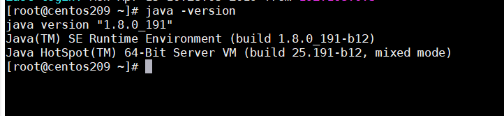

# Elasticsearch集群服务的安装

下载文件 [elasticsearch-6.2.2.tar.gz](../tools/linux/elasticsearch-6.2.2.tar.gz)
## 一、Elasticsearch集群服务的安装
###1.环境介绍
 
###2.java版本
 
###3.新建用户、用户组
(1)创建用户组
```
groupadd hadoop
```
 (2)新建用户并指定用户组为 hadoop用户组,并自动建立登录目录
 ```
useradd es -g hadoop -n -m
```
(3)设置es用户密码
```
passwd es
```
###4.上传安装包 elasticsearch-6.2.2.tar.gz
上传elasticsearch-6.2.2.tar.gz安装包到/home/es/目录下

(1)创建安装目录、软件存放目录

进入/home/es/目录下
```
mkdir app 	# 软件安装目录
mkdir soft 	# 安装包存储目录
```
 (2)修改文件权限
 ```
chmod u+x elasticsearch-6.2.2.tar.gz
```
(3)解压文件
```
tar -xvf elasticsearch-6.2.2.tar.gz
```
(4)重命名文件夹
```
mv elasticsearch-6.2.2 elasticsearch
```
(5)剪切到安装目录
```
mv elasticsearch /home/es/app/
```
 

(6)创建elasticsearch数据目录

进入/home/es/app/elasticsearch/
```
mkdir data  #结果目录/home/es/app/elasticsearch/data
```
(7)修改elasticsearch的拥有者设为 es 群组的使用者 hadoop
```
chown -R es:hadoop /home/es/app/elasticsearch
```
###5.修改elasticsearch配置文件 
(1)修改配置文件elasticsearch/config/elasticsearch.yml
```
 # ======================== Elasticsearch Configuration =========================
 #
 # NOTE: Elasticsearch comes with reasonable defaults for most settings.
 #       Before you set out to tweak and tune the configuration, make sure you
 #       understand what are you trying to accomplish and the consequences.
 #
 # The primary way of configuring a node is via this file. This template lists
 # the most important settings you may want to configure for a production cluster.
 #
 # Please consult the documentation for further information on configuration options:
 # https://www.elastic.co/guide/en/elasticsearch/reference/index.html
 #
 # ---------------------------------- Cluster -----------------------------------
 #
 # Use a descriptive name for your cluster:
 #
 #cluster.name: my-application
 # 集群的名称 
 cluster.name: elasticsearch 
 #
 # ------------------------------------ Node ------------------------------------
 #
 # Use a descriptive name for the node:
 #
 #node.name: node-1
 # 节点名称，不同机器节点名称不相同 
 node.name: hadoop72 
 # 指定该节点是否有资格被选举成为master节点,默认是true,es是默认集群中的第一台机器为master，如果这台机挂了就会重新选举master 
 node.master: true 
 # 允许该节点存储数据(默认开启) 
 node.data: true 
 #
 # Add custom attributes to the node:
 #
 #node.attr.rack: r1
 #
 # ----------------------------------- Paths ------------------------------------
 #
 # Path to directory where to store the data (separate multiple locations by comma):
 #
 #path.data: /path/to/data
 # 索引数据的存储路径 
 path.data: /home/es/app/elasticsearch/data 
 #
 # Path to log files:
 #
 #path.logs: /path/to/logs
 # 日志文件的存储路径 
 path.logs: /home/es/app/elasticsearch/logs 
 #
 # ----------------------------------- Memory -----------------------------------
 #
 # Lock the memory on startup:
 #
 #bootstrap.memory_lock: true
 bootstrap.system_call_filter: false
 #
 # Make sure that the heap size is set to about half the memory available
 # on the system and that the owner of the process is allowed to use this
 # limit.
 #
 # Elasticsearch performs poorly when the system is swapping the memory.
 #
 # ---------------------------------- Network -----------------------------------
 #
 # Set the bind address to a specific IP (IPv4 or IPv6):
 #
 #network.host: 192.168.0.1
 # 绑定的ip地址 
 network.host: 192.168.0.209 
 #
 # Set a custom port for HTTP:
 #
 #http.port: 9200
 # 设置对外服务的http端口,默认为9200 
 http.port: 9200 
 # 设置节点间交互的tcp端口,默认是9300 
 transport.tcp.port: 9300 
 #
 # For more information, consult the network module documentation.
 #
 # --------------------------------- Discovery ---------------------------------- 
 # 
 # Pass an initial list of hosts to perform discovery when new node is started: 
 # The default list of hosts is ["127.0.0.1", "[::1]"] 
 # 
 #discovery.zen.ping.unicast.hosts: ["host1", "host2"] 
 #Elasticsearch将绑定到可用的环回地址，并将扫描端口9300到9305以尝试连接到运行在同一台服务器上的其他节点。 
 #这提供了自动集群体验，而无需进行任何配置。数组设置或逗号分隔的设置。每个值的形式应该是host:port或host 
 #（如果没有设置，port默认设置会transport.profiles.default.port 回落到transport.tcp.port）。 
 #请注意，IPv6主机必须放在括号内。默认为127.0.0.1, [::1] 
 discovery.zen.ping.unicast.hosts: ["192.168.0.209:9300", "192.168.0.214:9300", "192.168.0.215:9300"] 
 discovery.zen.fd.ping_timeout: 120s 
 discovery.zen.fd.ping_retries: 6 
 discovery.zen.fd.ping_interval: 30s 
 client.transport.ping_timeout : 60s 
 # 
 # Prevent the "split brain" by configuring the majority of nodes (total number of master-eligible nodes / 2 + 1): 
 # 
 #discovery.zen.minimum_master_nodes: 
 # 如果没有这种设置,遭受网络故障的集群就有可能将集群分成两个独立的集群 - 分裂的大脑 - 这将导致数据丢失 
 discovery.zen.minimum_master_nodes: 2 
 # 
 # For more information, consult the zen discovery module documentation. 
 # 
 # ---------------------------------- Gateway -----------------------------------
 #
 # Block initial recovery after a full cluster restart until N nodes are started:
 #
 #gateway.recover_after_nodes: 3
 #
 # For more information, consult the gateway module documentation.
 #
 # ---------------------------------- Various -----------------------------------
 #
 # Require explicit names when deleting indices:
 #
 #action.destructive_requires_name: true
```
(2)调整JVM内存 elasticsearch/config/jvm.options
```
-Xms2g
-Xmx2g
```
(3)修改系统配置
```
vim /etc/security/limits.conf
```
切换root用户，在Linux系统上，可以通过编辑 /etc/security/limits.conf 文件为特定用户设置持久限制。要将用户的最大打开文件数设置es为65536
请将以下行添加到limits.conf文件中：
```
es soft nofile 65536
es hard nofile 65536
es soft nproc 16384
es hard nproc 16384
es soft stack 10240
# 此更改仅在es用户下次打开新会话时生效。
```
(4)修改 /etc/sysctl.conf
```
vim /etc/sysctl.conf
```
添加以下配置
```
vm.max_map_count = 655360
```
执行以下命令立即生效
```
sysctl -p 
```
(5)开放9200、9300端口，其中一台主机开放5601端口
```
vim /etc/sysconfig/iptables
```
添加如下配置
```
-A INPUT -m state --state NEW -m tcp -p tcp --dport 5601 -j ACCEPT
-A INPUT -m state --state NEW -m tcp -p tcp --dport 9200 -j ACCEPT
-A INPUT -m state --state NEW -m tcp -p tcp --dport 9300 -j ACCEPT
```
重启防火墙
```
service iptables restart
```
###6.启动es
es不能以root用户启动，切换到es用户
切换到elsaticsearch目录下的bin文件夹，执行后台启动命令
```
./elasticsearch -d 
```
查看elasticsearch是否启动
```
ps -ef|grep elasticsearch
```
停止服务
```
kill -9 进程号
ps -ef|grep elasticsearch
```
验证服务是否正常
```
curl -i "http://192.168.0.209:9200"
```
##二、安装Kibana
下载文件 [kibana-6.2.2-linux-x86_64.tar.gz](../tools/linux/kibana-6.2.2-linux-x86_64.tar.gz)
###1.修改文件权限
```
chmod u+x kibana-6.2.2-linux-x86_64.tar.gz
```
###2.解压
文件解压到/home/es/app/kibana/目录下
```
tar -xvf kibana-6.2.2-linux-x86_64.tar.gz
```
###3.修改配置文件
修改配置文件 config/kibana.yml,每台服务器修改为对应的ip
```
server.host: "192.168.0.209"
elasticsearch.url: "http://192.168.0.209:9200"
```
###4.启动kibana
切换到kibana目录下的bin文件夹，执行后台启动命令
```
nohup ./kibana &
【注意】：使用此命令依然会打印日志,但运行 Ctrl+C 后不会关闭进程, 不可直接关闭shell窗口，须运行 exit命令退出shell窗口
```
停止命令
```
fuser -n tcp 5601
```
关闭进程 
```
kill -9 进程号
```
###5.访问地址
```
http://192.168.0.209:5601/app/kibana
```
##三、Elasticsearch基础操作
1.检查集群的健康状况
```
GET	/_cat/health?v
```
2.查看集群中索引
```
GET	/_cat/indices?v
```
3.集群健康
```
GET _cat/health?v
```
4.磁盘使用情况
```
GET _cat/allocation?v
```
5.内存使用情况 
```
GET _cat/nodes?v
```