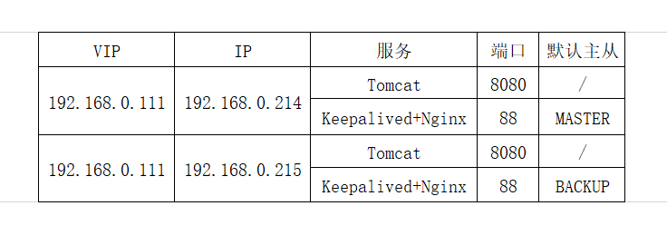
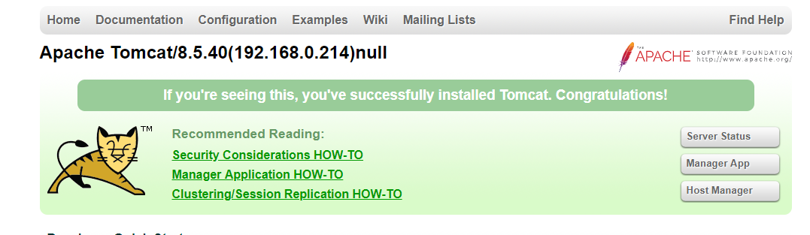
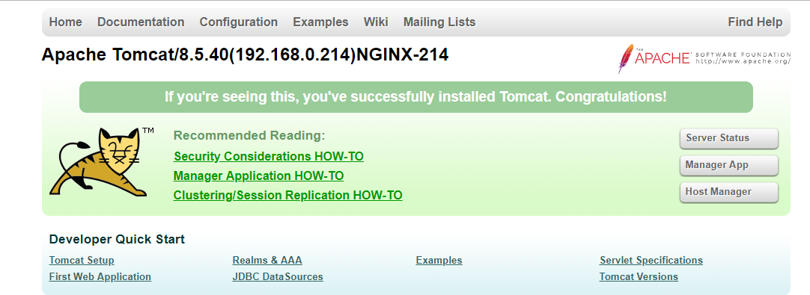
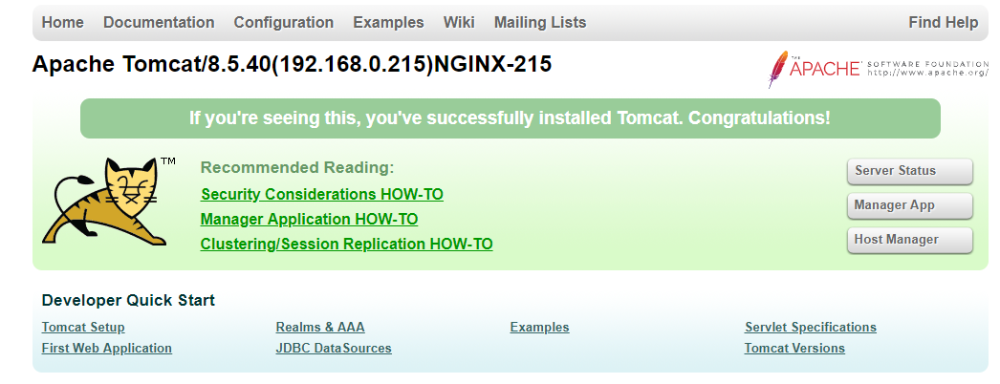

# Keepalived+Nginx+Tomcat实现高可用Web服务(主备模式)
## 环境准备

## 第一部分安装Tomcat 
需先准备JDK环境（如没有安装先安装jdk）
### 一、查看服务器上tomcat版本
```
[root@izuf61z1rt2fvuhr3u07s0z ~]# yum search tomcat
```
### 二、安装
#### 1.进入安装目录(目录自选，或者自己新建)
```
[root@izuf61z1rt2fvuhr3u07s0z ~]# cd /home/tomcat/
```
#### 2.下载压缩包(选择tomcat8版本)
```
# wget http://mirror.bit.edu.cn/apache/tomcat/tomcat-8/v8.5.40/bin/apache-tomcat-8.5.40.tar.gz
```
#### 3.解压安装包
```
# tar -zxvf apache-tomcat-8.5.40.tar.gz
```
#### 4.重命名文件夹(文件夹名字，推荐下划线加端口号方式。区分不同容器)
```
# mv apache-tomcat-8.5.40 tomcat_8031
```
#### 5.更改tomcat端口号防止多个tomcat运行冲突(共有3处需要更改)
##### 首先找到tomcat安装目录下的conf文件夹下server.xml文件
##### 更改没有被占用的端口
```
<Server port="8005" shutdown="SHUTDOWN">(更改前)

<Server port="8020" shutdown="SHUTDOWN">(更改后)
```
##### 此处为tomcat的运行端口只需更改8080为需要的端口即可
```
<Connector port="8080" protocol="HTTP/1.1" connectionTimeout="20000" redirectPort="8443" />(更改前)

<Connector port="8030" protocol="HTTP/1.1" connectionTimeout="20000" redirectPort="8443" />(更改后)
```
##### 最后更改此处端口
```
<Connector port="8009" protocol="AJP/1.3" redirectPort="8443" />(更改前)

<Connector port="8040" protocol="AJP/1.3" redirectPort="8443" />(更改后)
```

按上述步骤在192.168.0.214，192.168.0.215上安装tomcat，并修改ROOT/index.jsp页面，在页面中加入tomcat的IP地址，并打印出request header中的X-NGINX值，这个值，我们将在后面配置NGINX时传入，如192.168.0.214上我们修改为：
```
<div id="asf-box">
    <h1>${pageContext.servletContext.serverInfo}(192.168.0.214)<%=request.getHeader("X-NGINX")%></h1>
</div>
```
#### 6.进入启动目录，启动tomcat
```
# cd /home/tomcat/tomcat_8031/bin/
# ./startup.sh
```
#### 7.测试Tomcat访问
确认浏览器能正确访问http://192.168.0.214:8080和http://192.168.0.215:8080。并且页面上能正确显示各自的IP地址，此时request header里没有X-NGINX，所以显示null。 



## 第二部分安装Nginx
### 一、安装
#### 1.安装gcc (如新环境,未安装请先安装)
```
$ yum install -y gcc gcc-c++
```
#### 2.安装PCRE库
```
$ cd /usr/local/
$ wget https://jaist.dl.sourceforge.net/project/pcre/pcre/8.33/pcre-8.33.tar.gz
$ tar -zxvf pcre-8.33.tar.gz
$ cd pcre-8.33
$ ./configure
$ make && make install

如报错:configure: error: You need a C++ compiler for C++ support
解决:yum install -y gcc gcc-c++
```
#### 3.安装SSL库
```
$ cd /usr/local/
$ wget http://www.openssl.org/source/openssl-1.0.1j.tar.gz
$ tar -zxvf openssl-1.0.1j.tar.gz
$ cd openssl-1.0.1j
$ ./config
$ make && make install
```
#### 4.安装zlib库存
```
$ cd /usr/local/
$ wget http://zlib.net/zlib-1.2.11.tar.gz
$ tar -zxvf zlib-1.2.11.tar.gz
$ cd zlib-1.2.11
$ ./configure
$ make && make install
```
#### 5.安装nginx
```
$ cd /usr/local/
$ wget http://nginx.org/download/nginx-1.8.0.tar.gz
$ tar -zxvf nginx-1.8.0.tar.gz
$ cd nginx-1.8.0
$ ./configure --user=nobody --group=nobody --prefix=/usr/local/nginx --with-pcre=/usr/local/pcre-8.33 --with-http_stub_status_module --with-http_gzip_static_module --with-http_realip_module --with-http_sub_module --with-http_ssl_module
$ make && make install
报错:./configure: error: the HTTP gzip module requires the zlib library
在–prefix后面接以下命令: --with-pcre=/usr/local/pcre-8.33

报错：
./configure: error: SSL modules require the OpenSSL library.
You can either do not enable the modules, or install the OpenSSL library
into the system, or build the OpenSSL library statically from the source
with nginx by using --with-openssl=<path> option.

解决：
./configure --user=nobody --group=nobody --prefix=/usr/local/nginx --with-pcre=/usr/local/pcre-8.33 --with-openssl=/usr/local/openssl-1.0.1j  --with-http_stub_status_module --with-http_gzip_static_module --with-http_realip_module --with-http_sub_module --with-http_ssl_module

```
#### 6.启动
```
$ /usr/local/nginx/sbin/nginx
```
#### 7.重启
```
$ /usr/local/nginx/sbin/nginx -s reload
```
#### 8.停止
```
$ /usr/local/nginx/sbin/nginx -s stop
```
#### 9.测试配置文件是否正确
```
$ /usr/local/nginx/sbin/nginx -t
```
#### 10.强制关闭
```
$ pkill nginx
```
### 二、配置Nginx反向代理
#### 1.修改/usr/local/nginx/conf/nginx.conf配置文件
为了能在tomcat页面上看出是哪台nginx转发过来的请求，我们这里给两台nginx分别配置两个自定义的header传给tomcat，tomcat将其取出打印在页面上。在Master（214）中设置proxy_set_header X-NGINX “NGINX-214”
```
#user  nobody;
worker_processes  1;

#error_log  logs/error.log;
#error_log  logs/error.log  notice;
#error_log  logs/error.log  info;

#pid        logs/nginx.pid;
events {
    worker_connections  1024;
}
http {
    include       mime.types;
    default_type  application/octet-stream;

    #log_format  main  '$remote_addr - $remote_user [$time_local] "$request" '
    #                  '$status $body_bytes_sent "$http_referer" '
    #                  '"$http_user_agent" "$http_x_forwarded_for"';

    #access_log  logs/access.log  main;

    sendfile        on;
    #tcp_nopush     on;

    #keepalive_timeout  0;
    keepalive_timeout  65;

    #gzip  on;

    upstream myserver{
       server 192.168.0.214:8080 weight=1 max_fails=2;
       server 192.168.0.215:8080 weight=1 max_fails=2;
    }
    
    server {
        listen       88;
        server_name  localhost;

        #charset koi8-r;

        #access_log  logs/host.access.log  main;

        location / {
            root   html;
            index  index.html index.htm;
            proxy_pass http://myserver; #这里的myserver必须要和upstream中指定的一致
            proxy_set_header X-NGINX "NGINX-214";
            #proxy_redirect on;
            proxy_next_upstream http_502 http_504 http_404 error timeout invalid_header;
        }

        #error_page  404              /404.html;

        # redirect server error pages to the static page /50x.html
        #
        error_page   500 502 503 504  /50x.html;
        location = /50x.html {
            root   html;
        }

        # proxy the PHP scripts to Apache listening on 127.0.0.1:80
        #
        #location ~ \.php$ {
        #    proxy_pass   http://127.0.0.1;
        #}

        # pass the PHP scripts to FastCGI server listening on 127.0.0.1:9000
        #
        #location ~ \.php$ {
        #    root           html;
        #    fastcgi_pass   127.0.0.1:9000;
        #    fastcgi_index  index.php;
        #    fastcgi_param  SCRIPT_FILENAME  /scripts$fastcgi_script_name;
        #    include        fastcgi_params;
        #}

        # deny access to .htaccess files, if Apache's document root
        # concurs with nginx's one
        #
        #location ~ /\.ht {
        #    deny  all;
        #}
    }
}
```
在Backup（215）中设置proxy_set_header X-NGINX “NGINX-215”
```
    upstream myserver{
       server 192.168.0.214:8080 weight=1 max_fails=2;
       server 192.168.0.215:8080 weight=1 max_fails=2;
    }
    server {
            listen       88;
            server_name  localhost;
    
            #charset koi8-r;
    
            #access_log  logs/host.access.log  main;
    
            location / {
                root   html;
                index  index.html index.htm;
                proxy_pass http://myserver; #这里的myserver必须要和upstream中指定的一致
                proxy_set_header X-NGINX "NGINX-215";
                #proxy_redirect on;
                proxy_next_upstream http_502 http_504 http_404 error timeout invalid_header;
            }
    }
```
#### 2.测试nginx代理效果
执行reload命令，使配置生效
```
$ /usr/local/nginx/sbin/nginx –s reload
```
按照上面方法在Master（214）上安装和配置好nginx，浏览器地址栏输入http://192.168.0.214:88，多次刷新页面，能看到页面上显式IP地址信息，192.168.0.214和192.168.0.215交替显式，说明nginx已经将用户请求负载均衡到了2台tomcat上 ，并且能看到NGINX-214也能显示在页面上，如下图 



同理在Backup（215）上安装和配置好nginx，浏览器地址栏输入http://192.168.0.215:88，多次刷新页面，能看到页面上显式IP地址信息，192.168.0.214和192.168.0.215交替显式，说明nginx已经将用户请求负载均衡到了2台tomcat上 ，并且能看到NGINX-2也能显示在页面上，如下图 



### 三、nginx日志拆分
脚本下载 [cut_nginx_logs.sh](../tools/linux/cut_nginx_logs.sh)

#### 1、配置crontab定时任务
```
$ crontab -e
按下 a 键进入到编辑模式
输入以下内容
00 00 * * * /bin/bash /usr/local/nginx/sbin/cut_nginx_log.sh
同时按下 ctrl+c 退出编辑模式
按下 shift+: 输入 wq 退出 crontab
```
#### 2、错误问题解决
```
可以先直接运行脚本看脚本是否能用
若提示权限不够：$ chmod +x cut_nginx.logs.sh
再运行脚本
若提示遇到/bin/sh^M: bad interpreter:没有那个文件或目录这样的错误
可以用以下方式解决:
先在控制台cd到报错的目录
vi xxx.sh(报错的那个文件)
:set ff ?
如果出现fileforma＝dos那么就基本可以确定是这个问题了。
:set fileformat=unix
:wq
```

## 第三部分安装Keepalived
### 安装依赖	
```
yum install -y libnfnetlink-devel
yum -y install openssl-devel

```
### 进入安装目录
```
cd /usr/local/
```

### 下载压缩包(版本自选)
```
wget https://keepalived.org/software/keepalived-2.0.6.tar.gz
```

### 解压安装包
```
tar -xvf keepalived-2.0.6.tar.gz
```

### 新建编译安装文件夹
```
mkdir keepalived
```

### 进入安装包目录
```
cd keepalived-2.0.6
```

### 编译安装（--prefix=编译安装目录）
```
./configure --prefix=/usr/local/keepalived

``` 
	
### 安装
```
make && make install
```

### 修改配置文件
/usr/local/keepalived/etc/keepalived/keepalived.conf
#### 配置文件(master)

```
! Configuration File for keepalived
global_defs {
   notification_email {#收件人邮箱可定义多个
     xxxx@qq.com
     xxxx@qq.com
   }
   notification_email_from Alexandre.Cassen@firewall.loc #发邮件人可以伪装
   smtp_server  127.0.0.1  #发送邮件的服务器地址
   smtp_connect_timeout 30 #连接超时时间
   router_id yuqingapi_master #设置nginx master的id，在一个网络应该是唯一的
   vrrp_skip_check_adv_addr
   vrrp_strict
   vrrp_garp_interval 0
   vrrp_gna_interval 0
}
vrrp_script chk_http_port {      #检测nginx服务是否在运行。有很多方式，比如进程，用脚本检测等等
    script "/etc/keepalived/nginx_check.sh"   #这里通过脚本监测
    interval 2                   #脚本执行间隔，每2s检测一次
    weight -5                    #脚本结果导致的优先级变更，检测失败（脚本返回非0）则优先级 -5
    fall 2                    #检测连续2次失败才算确定是真失败。会用weight减少优先级（1-255之间）
    rise 1                    #检测1次成功就算成功。但不修改优先级
}
vrrp_instance VI_1 { 
    state MASTER #值为 MASTER 当前节点为主节点 BACKUP 为备用节点(具体还要根据priority值来决定)
    interface eth0 #当前进行vrrp通讯的网络接口卡(当前centos的网卡) 可以改成自己的网卡名字，因人而异不同，用ip a这个命令可以查看
    virtual_router_id 51 #虚拟路由的id号，一般不能大于255的（并且主从节点需要保持一致）
    mcast_src_ip 192.168.0.214 ## 本机 IP 地址
    priority 150 #初始化优先级，数值越大，获取处理请求的优先级越高（交换配置文件的主从值要间隔50）
    advert_int 1 #检查间隔，默认为1s(vrrp组播周期秒数)
    authentication {
        auth_type PASS
        auth_pass 1111
    }
    virtual_ipaddress { #虚拟IP可定义多个
        10.10.200.111
        #192.168.200.17
        #192.168.200.18
    }
    track_script {                      #执行监控的服务。注意这个设置不能紧挨着写在vrrp_script配置块的后面（实验中碰过的坑），否则nginx监控失效！！
       chk_http_port                    #引用VRRP脚本，即在 vrrp_script 部分指定的名字。定期运行它们来改变优先级，并最终引发主备切换。
    }
}

```
### 注意事项
#### 1.出现两台keepalived都绑定虚拟ip(VIP)情况处理
(1)服务器都要关闭防火墙，不关闭就要增加vrrp策略
```
-A INPUT -p vrrp -j ACCEPT
```
(2)keepalived的vrid设置的和其他机器不同，但主从节点要相同，且最后修改密码
```
    virtual_router_id 66
    authentication {
        auth_type PASS
        auth_pass 2111
     }
```
#### 配置文件(backup)

```
! Configuration File for keepalived
global_defs {
   notification_email {#收件人邮箱可定义多个
     xxxx@qq.com
     xxxx@qq.com
   }
   script_user root
   enable_script_security
   notification_email_from Alexandre.Cassen@firewall.loc #发邮件人可以伪装
   smtp_server  127.0.0.1  #发送邮件的服务器地址
   smtp_connect_timeout 30 #连接超时时间
   router_id yuqingapi_backup1 #设置nginx master的id，在一个网络应该是唯一的
   vrrp_skip_check_adv_addr
   #vrrp_strict
   vrrp_garp_interval 0
   vrrp_gna_interval 0
}
vrrp_script chk_http_port {      #检测nginx服务是否在运行。有很多方式，比如进程，用脚本检测等等
    script "/etc/keepalived/nginx_check.sh"   #这里通过脚本监测
    interval 2                   #脚本执行间隔，每2s检测一次
    weight -5                    #脚本结果导致的优先级变更，检测失败（脚本返回非0）则优先级 -5
    fall 2                    #检测连续2次失败才算确定是真失败。会用weight减少优先级（1-255之间）
    rise 1                    #检测1次成功就算成功。但不修改优先级
}
vrrp_instance VI_1 { 
    state BACKUP #值为 MASTER 当前节点为主节点 BACKUP 为备用节点(具体还要根据priority值来决定)
    interface eth0 #当前进行vrrp通讯的网络接口卡(当前centos的网卡) 可以改成自己的网卡名字，因人而异不同，用ip a这个命令可以查看
    virtual_router_id 51 #虚拟路由的id号，一般不能大于255的（并且主从节点需要保持一致）
    mcast_src_ip 192.168.0.215 ## 本机 IP 地址
    priority 100 #初始化优先级，数值越大，获取处理请求的优先级越高（交换配置文件的主从值要间隔50）
    advert_int 1 #检查间隔，默认为1s(vrrp组播周期秒数)
    authentication {
        auth_type PASS
        auth_pass 1111
    }
    virtual_ipaddress { #虚拟IP可定义多个
        10.10.200.111
        #192.168.200.17
        #192.168.200.18
    }
    track_script {                      #执行监控的服务。注意这个设置不能紧挨着写在vrrp_script配置块的后面（实验中碰过的坑），否则nginx监控失效！！
       chk_http_port                    #引用VRRP脚本，即在 vrrp_script 部分指定的名字。定期运行它们来改变优先级，并最终引发主备切换。
    }
}

```
### 编写 Nginx 状态检测脚本
编写 Nginx 状态检测脚本 /etc/keepalived/nginx_check.sh (已在 keepalived.conf 中配置)脚本要求：如果 nginx 停止运行，尝试启动，如果无法启动则杀死本机的 keepalived 进程， keepalied将虚拟 ip 绑定到 BACKUP 机器上。 内容如下：
```
#!/bin/bash
counter=$(ps -C nginx --no-heading|wc -l)
if [ "${counter}" = "0" ]; then
    /usr/local/nginx/sbin/nginx
    sleep 2
    counter=$(ps -C nginx --no-heading|wc -l)
    if [ "${counter}" = "0" ]; then
        /etc/init.d/keepalived stop
    fi
fi
```

### 进入解压缩之后的源码包init.d目录下
```
cd  /usr/local/keepalived-2.0.6/keepalived/etc/init.d/
```

### 拷贝源码包下的keppalived文件到系统环境下的inti.d文件夹下
```
cp keepalived  /etc/init.d/keepalived
```

### 创建一个新的文件夹
```
mkdir  /etc/keepalived/
```

### 进入安装路径下的keepalived文件夹找到配置文件(keepalived.conf)
```
cd /usr/local/keepalived/etc/keepalived/
```

### 拷贝已安装好的配置文件到之前新建的文件夹下
```
cp  keepalived.conf  /etc/keepalived/
```

### 进入安装目录下的系统配置文件夹(sysconfig)
```
cd /usr/local/keepalived/etc/sysconfig/
```

### 拷贝已安装目录下的启动文件到系统配置文件夹(sysconfig)
```
cp keepalived  /etc/sysconfig/keepalived
```

### 拷贝安装目录下的配置文件到系统环境下
```
cp  /usr/local/keepalived/sbin/keepalived  /usr/bin
cp  /usr/local/keepalived/sbin/keepalived  /usr/sbin
```

## 运行命令
### 启动（注意，服务启动是去系统目录下找配置文件，安装目录配置文件不起效）
```
service  keepalived  start
```

### 停止
```
service  keepalived  stop
```

### 重启
```
service  keepalived  restart
```

### 查看日志（日志默认写在系统日志，可根据需求自行更改）
```
cat /var/log/messages
tail -f -n 200 /var/log/messages
```

#### 查看虚拟IP生成结果
```
ip add
```

### 设置服务开机自启动并查看
```
echo "/usr/local/tomcat/apache-tomcat-8.5.40/bin/startup.sh start" >> /etc/rc.local
echo "/usr/local/nginx/sbin/nginx" >> /etc/rc.local
echo "/etc/init.d/keepalived start" >> /etc/rc.local

将rc.local修改为可执行
chmod 777 /etc/rc.d/rc.local
```

若虚拟ip不能ping通，则把/etc/keepalived/keepalived.conf中vrrp_strict注释掉就可以了，默认是禁ping的。

```
启动Tomcat:
cd /usr/local/tomcat/apache-tomcat-8.5.40/bin/
./startup.sh

启动Nginx:
/usr/local/nginx/sbin/nginx

启动Keepalived:
service keepalived start

停止Tomcat:
cd /usr/local/tomcat/apache-tomcat-8.5.40/bin/
./shutdown.sh

停止Nginx:
/usr/local/nginx/sbin/nginx -s stop

停止Keepalived:
service keepalived stop
```
### 注意事项
#### 1.出现两台keepalived都绑定虚拟ip(VIP)情况处理
(1)服务器都要关闭防火墙，不关闭就要增加vrrp策略
```
-A INPUT -p vrrp -j ACCEPT
```
(2)keepalived的vrid设置的和其他机器不同，但主从节点要相同，且最后修改密码
```
    virtual_router_id 66
    authentication {
        auth_type PASS
        auth_pass 2111
     }
```

### 参考资料
Keepalived之——Keepalived + Nginx 实现高可用 Web 负载均衡:https://blog.csdn.net/l1028386804/article/details/72801492

Nginx之——Nginx+keepalived双机热备（主从模式）:https://blog.csdn.net/l1028386804/article/details/80098334

Keepalived+Nginx+Tomcat搭建高可用的Web服务（一）：主备模式:https://blog.csdn.net/apei830/article/details/78685855

Keepalived两节点出现双VIP情况及解决方法:https://www.cnblogs.com/paul8339/p/9927636.html
      
