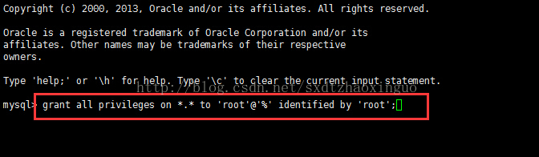

# mysql5.6服务的安装
## 一、卸载
### 1.检测系统是否自带安装mysql
```
[root@izuf61z1rt2fvuhr3u07s0z ~]# yum list installed | grep mysql
```
### 2.卸载命令
```
[root@izuf61z1rt2fvuhr3u07s0z ~]# yum -y remove mysql-libs.x86_64
```
## 二、安装
### 1.在你存放文件的目录下执行，下载mysql5.6的安装包
```
# wget http://repo.mysql.com/mysql-community-release-el6-5.noarch.rpm
```
### 2.这个rpm还不是mysql的安装文件，只是两个yum源文件，需执行这句后，在/etc/yum.repos.d/ 这个目录下多出mysql-community-source.repo和mysql-community.repo
```
# rpm -ivh mysql-community-release-el6-5.noarch.rpm  
```
### 3.查看一下是否已经有mysql可安装文件
```
# yum repolist all | grep mysql
```
### 4.安装mysql 服务器命令
```
# yum install mysql-community-server -y
```
### 5.安装mysql 服务器命令
```
# yum install mysql-community-server -y
```
### 6.查看mysql是否自启动,并且设置开启自启动命令
```
# chkconfig --list | grep mysqld
# chkconfig mysqld on
```
### 7.安装成功后，启动mysql
```
# service mysqld start
```
### 8.mysql安全设置，设置成功后需重启
```
# mysql_secure_installation
```
### 9.由于mysql刚刚安装完的时候，mysql的root用户的密码默认是空的，所以我们需要及时用mysql的root用户登录（第一次回车键，不用输入密码），并修改密码
```
# mysql -u root
# use mysql;
# update user set password=PASSWORD("这里输入root用户密码") where User='root';
# flush privileges;
```
### 10.mysql设置远程连接
```
# mysql -u root -p
# grant all privileges on *.* to 'root'@'%' identified by 'root';
```

到此安装结束了。