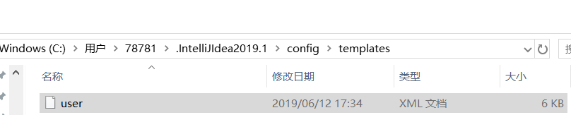
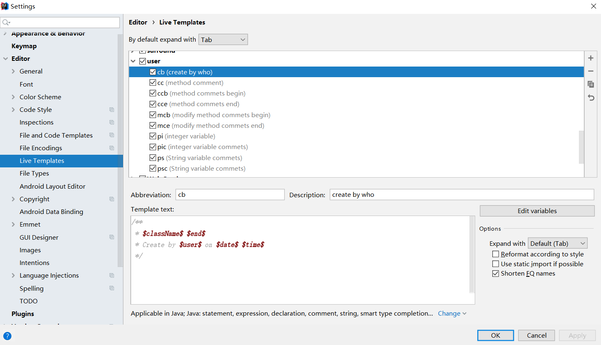
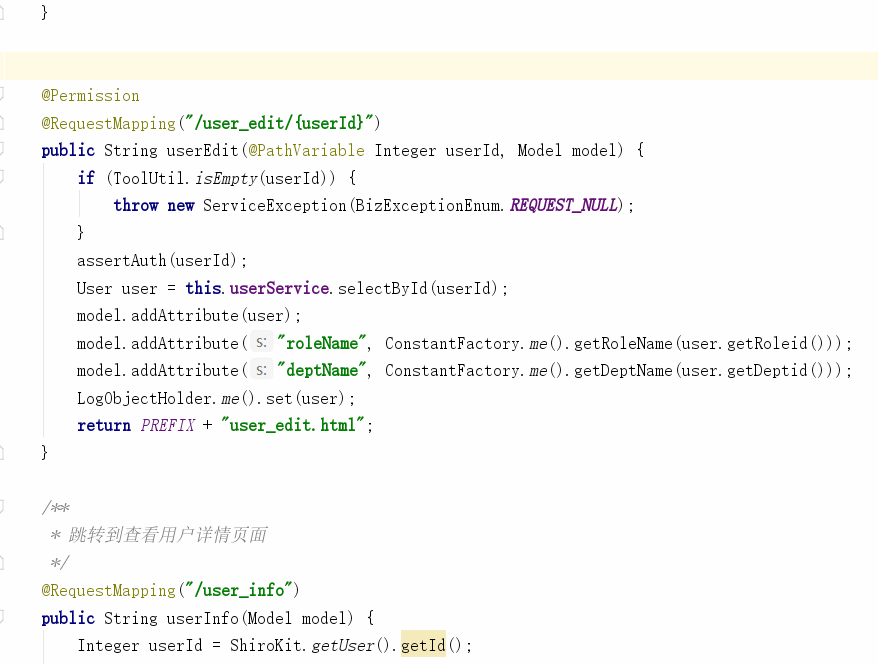
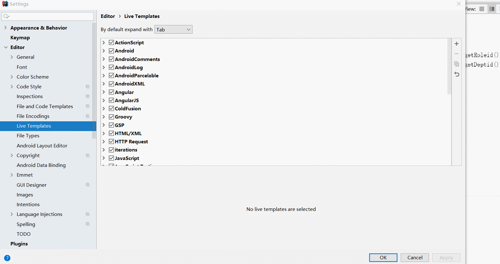
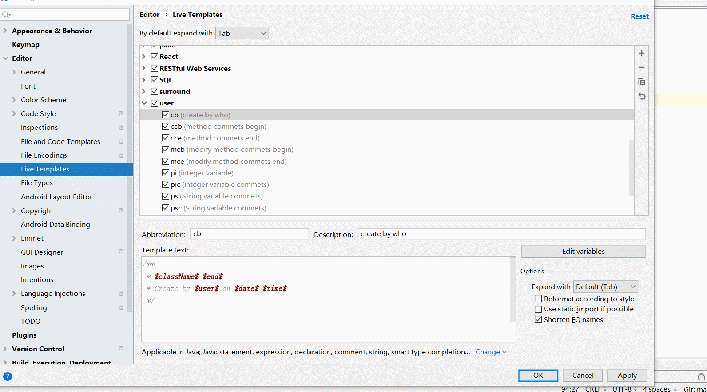

# Idea工具开发注释规范
## 一、通过已经配置好的文件，生成Idea开发注释模板
下载已经配置好的文件 [user.xml](../tools/standard/user.xml)
### 1.将下载下来的user.xml文件，复制到C:\Users\78781\\.IntelliJIdea2019.1\config\templates文件夹下，（78781为系统用户名）
 
### 2.复制之后，重启Idea工具，进入setting->editor->live templates,查看是否导入成功，如出现下图，则说明导入成功。
 
### 3."cb"、"cc"为快捷键，默认输入快捷键再点击TAB,即可生成代码注释
 
 
## 二、通过在Idea手工录入，配置live Templates模板
### 1.创建模板组
* Idea工具，进入setting->editor->live templates,先创建模板组user(可以自定义)


###  2.举个栗子：方法注释
2.1使用方法
* 先输入“/**”，然后按回车键，再输入快捷键“cc”(自定义)

2.2配置方法


###  3.其他注释
3.1Class的header注释
* 快捷键：cb
* 使用范围：java
* 备注：变量className->className()
* Template text：

```
/**
* $className$ $end$
* Create by $user$ on $date$ $time$
*/
```

3.2方法体注释
* 使用范围：java、css、js、html
* 快捷键：ccb
* Template text：

```
// add by $user$ for $end$ at $date$ $time$ begin
```

* 快捷键：cce
* Template text：

```
// add by $user$ for $end$ at $date$ $time$ end
```

* 快捷键：mcb
* Template text：

```
// modify by $user$ for $end$ at $date$ $time$ begin
```

* 快捷键：mce
* Template text：

```
// modify by $user$ for $end$ at $date$ $time$ end
```

3.3实体类变量注释
* 使用范围：java
* 快捷键：pi
* Template text：

```
private Integer $end$;
```

* 快捷键：ps
* Template text：

```
private String $end$;
```

* 快捷键：pic
* Template text：

```
/**
 * $var1$
 */
private Integer $var2$;

$end$
```

* 快捷键：psc
* Template text：

```
/**
 * $var1$
 */
private String $var2$;

$end$
```