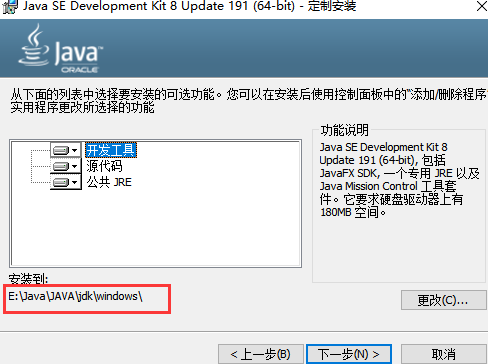
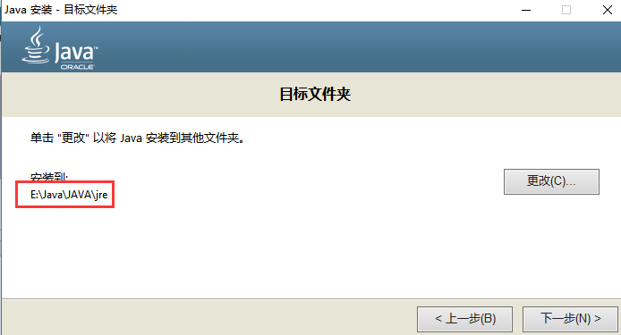
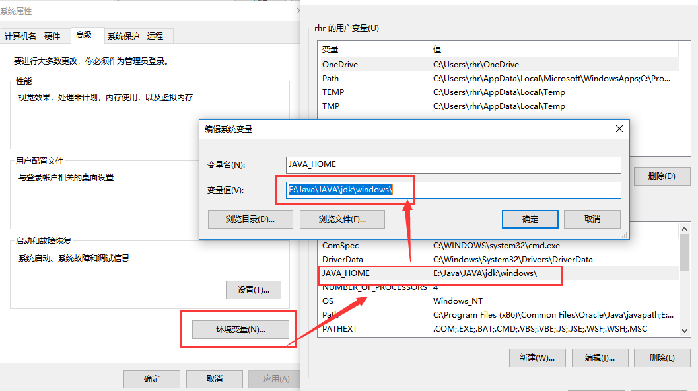
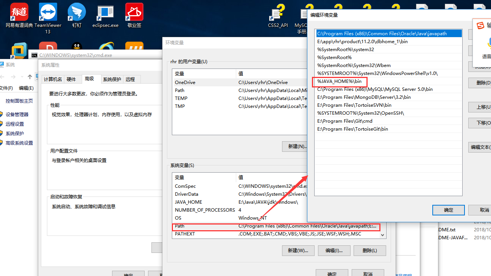

# jdk1.8 环境安装

下载文件 [jdk-8u171-windows-x64.exe](../tools/windows/jdk-8u171-windows-x64.exe)
### 1、查看电脑环境
```
    我的电脑--右键--属性
``` 
 
 
### 2.安装jdk1.8

没有写的步骤，按照向导安装
```
1）选择路径，我选择   ：  E:\Java\JAVA\jdk\windows
``` 
 
 
``` 
2）修改  JRE安装路径，我选择   ：  E:\Java\JAVA\jre
``` 
 
 
### 3.配置环境变量
```
1）调出环境变量配置
我的电脑--右键--属性--高级系统设置--高级--环境变量
```
 
```
2）开始配置环境变量

a、配置用户变量：  
JAVA_HOME    
E:\Java\JAVA\jdk\windows\(自己jdk的安装目录)
```
 
 ```
b、配置系统变量： 
PATH：新增 %JAVA_HOME%\bin
 ```
 
### 5、验证安装版本：
```
java -version
```
 
### 6.至此，java1.8环境已安装完成