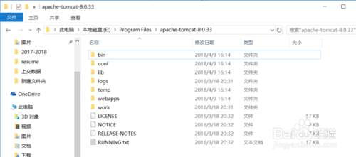
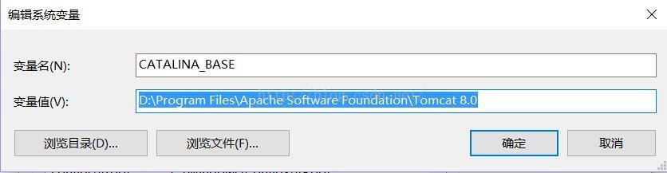
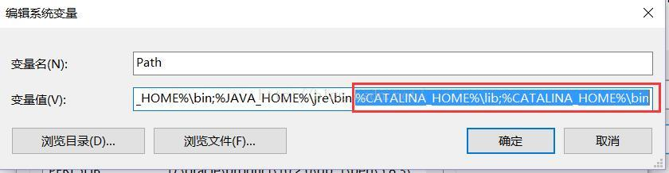
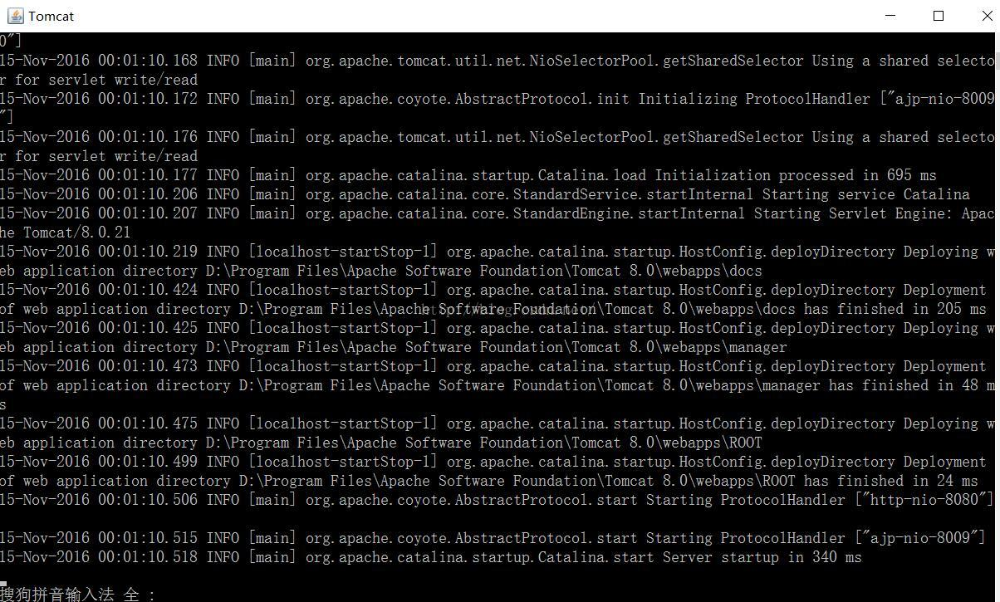

# Tomcat8 安装并配置

下载文件 [apache-tomcat-8.5.31.zip](../tools/windows/apache-tomcat-8.5.31.zip)
### 1、将压缩包解压到自己的文件夹
 
 
### 2.配置环境变量
```
1）调出环境变量配置
我的电脑--右键--属性--高级系统设置--高级--环境变量
```
 
```
2）开始配置环境变量

a、配置用户变量：  
CATALINA_BASE   
D:\Program Files\Apache Software Foundation\Tomcat 8.0(自己Tomcat的安装目录)
```
 
 ```
b、配置系统变量 
PATH：新增 %CATALINA_HOME%\lib;%CATALINA_HOME%\bin
 ```
 
### 5、启动Tomcat服务器，检查Tonmcat服务器有没有成功配置好：
```
在CMD命令下输入命令：startup，出现如下对话框，表明服务启动成功
```
 
### 6.至此，Tomcat8已安装完成