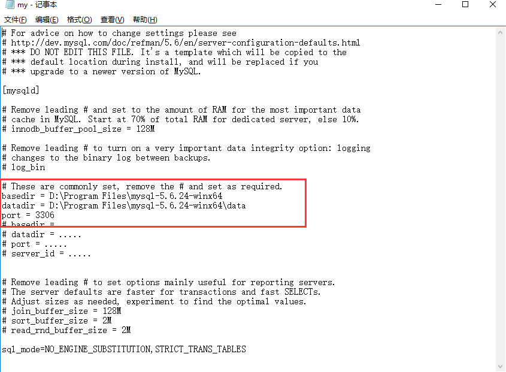
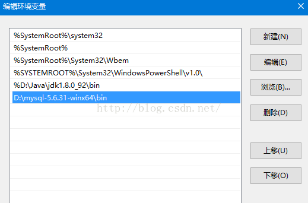
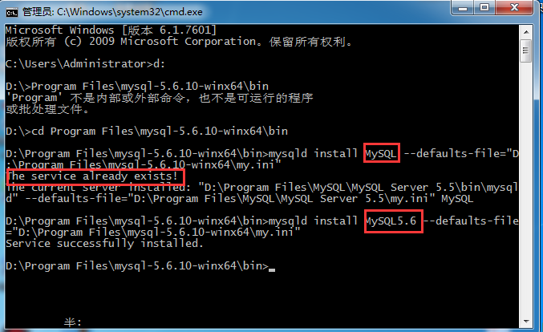
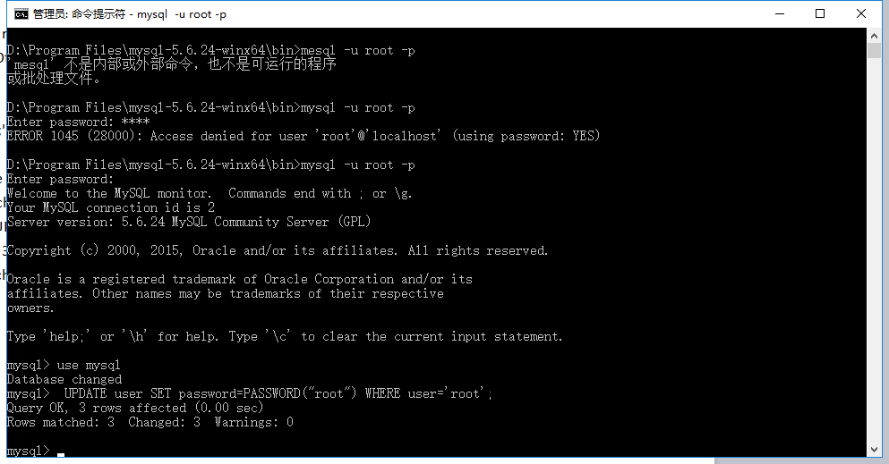

# mysql5.6 服务免安装版本

下载文件 [mysql-5.6.24-winx64.zip](../tools/windows/mysql-5.6.24-winx64.zip)
### 1.修改My.int文件路径地址配置（默认如下，如需自定义可修改）
 * 修改basedir设置安装的路径
 * 修改datadir设置安装的数据路径
 * 修改port端口号
 
 基本的配置文件如下

```
# For advice on how to change settings please see
# http://dev.mysql.com/doc/refman/5.6/en/server-configuration-defaults.html
# *** DO NOT EDIT THIS FILE. It's a template which will be copied to the
# *** default location during install, and will be replaced if you
# *** upgrade to a newer version of MySQL.

[mysqld]

# Remove leading # and set to the amount of RAM for the most important data
# cache in MySQL. Start at 70% of total RAM for dedicated server, else 10%.
# innodb_buffer_pool_size = 128M

# Remove leading # to turn on a very important data integrity option: logging
# changes to the binary log between backups.
# log_bin

# These are commonly set, remove the # and set as required.
basedir = D:\Program Files\mysql-5.6.24-winx64
datadir = D:\Program Files\mysql-5.6.24-winx64\data
port = 3306
# basedir = .....
# datadir = .....
# port = .....
# server_id = .....


# Remove leading # to set options mainly useful for reporting servers.
# The server defaults are faster for transactions and fast SELECTs.
# Adjust sizes as needed, experiment to find the optimal values.
# join_buffer_size = 128M
# sort_buffer_size = 2M
# read_rnd_buffer_size = 2M 

sql_mode=NO_ENGINE_SUBSTITUTION,STRICT_TRANS_TABLES 
```
效果如图：
 
 
 
### 2.环境变量配置
  点击系统环境变量path配置：
  
 
 
 新增环境变量，点击mysql文件夹到bin的位置：
 
 
 
### 3.安装用命令行安装mysql5.6服务
 安装命令
```
D:\Program Files\mysql-5.6.24-winx64\bin>mysqld install MySQL5.6 --defaults-file="D:\Program Files\mysql-5.6.24-winx64\my.ini"
```
出现如下信息，则说明安装成功
```
Service successfully installed.
```
 
 
### 4.删除服务命令
 ```
mysqld -remove MySQL5.6
```
### 5.修改密码(默认密码为空，修改为root)
```
D:\Program Files\mysql-5.6.24-winx64\bin>mesql -u root -p
'mesql' 不是内部或外部命令，也不是可运行的程序
或批处理文件。

D:\Program Files\mysql-5.6.24-winx64\bin>mysql -u root -p
Enter password: ****
ERROR 1045 (28000): Access denied for user 'root'@'localhost' (using password: YES)

D:\Program Files\mysql-5.6.24-winx64\bin>mysql -u root -p
Enter password:
Welcome to the MySQL monitor.  Commands end with ; or \g.
Your MySQL connection id is 2
Server version: 5.6.24 MySQL Community Server (GPL)

Copyright (c) 2000, 2015, Oracle and/or its affiliates. All rights reserved.

Oracle is a registered trademark of Oracle Corporation and/or its
affiliates. Other names may be trademarks of their respective
owners.

Type 'help;' or '\h' for help. Type '\c' to clear the current input statement.

mysql> use mysql
Database changed
mysql>  UPDATE user SET password=PASSWORD("root") WHERE user='root';
Query OK, 3 rows affected (0.00 sec)
Rows matched: 3  Changed: 3  Warnings: 0

```
 
### 6.至此，mysql服务已安装完成