# redis与redis集群服务的安装

windows版本GitHub下载地址：https://github.com/MSOpenTech/redis/releases

本文提供64位系统下载文件 [Redis-x64-3.2.100.zip](../tools/windows/Redis-x64-3.2.100.zip)
## 一、redis服务的安装
### 1.将压缩包解压到自己的文件夹
 
### 2.选择安装路径
```
选择安装路径，并勾选配置path（避免以后每次只能在安装目录下启动命令redis-server）。
```
 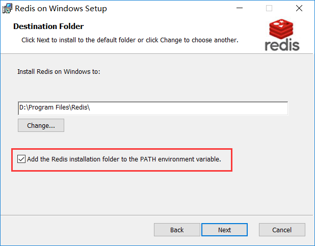
### 3.端口默认
 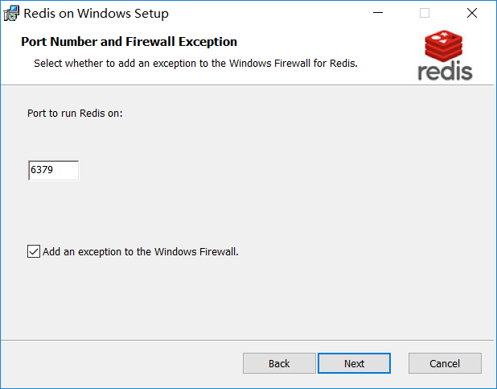
### 4.设置最大内存（按需设置）
 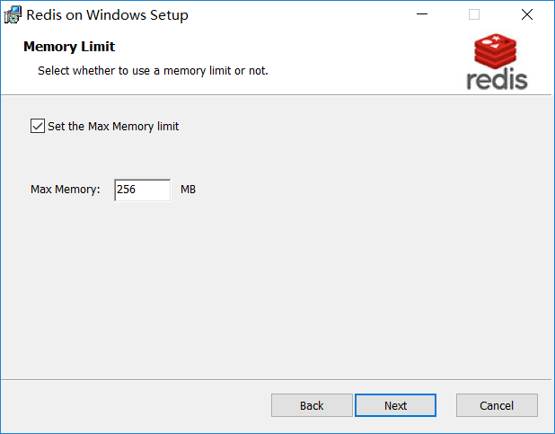
### 5、安装并查看安装结果
```
计算机管理-服务和应用程序-服务 看到Redis正在运行
```
 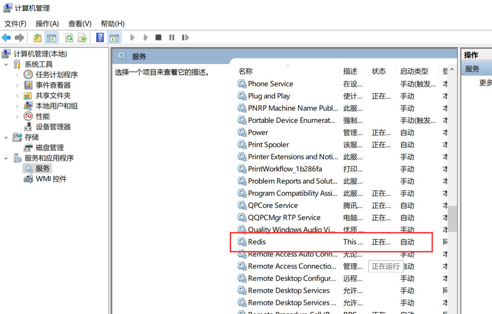
### 6.用客户端连接redis，测试一下
```
打开redis安装目录，双击redis-cli.exe
```
 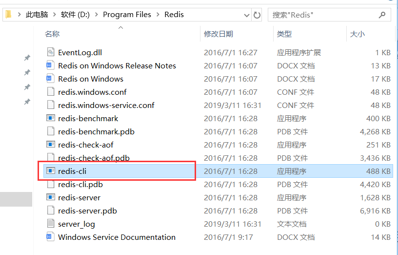
 ```
 测试一下
 ```
 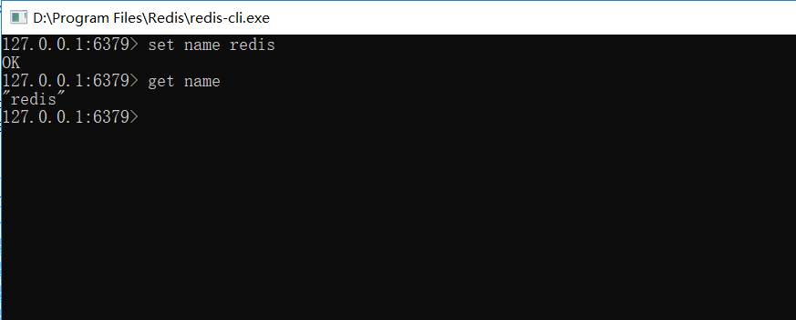
### 7.至此redis服务安装完毕
 
## 二、redis集群服务安装
### 1.安装Ruby并配置环境
下载文件 [rubyinstaller-devkit-2.5.1-2-x64.zip](../tools/windows/rubyinstaller-devkit-2.5.1-2-x64.zip)
```
解压并安装
```
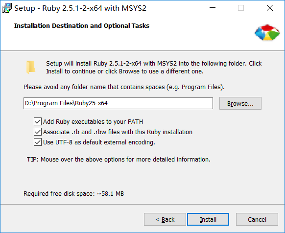
### 2.搭建Redis集群
要让集群正常工作至少需要三个主节点，此处我们使用6个节点（3主+3从）。

1）创建Redis集群目录
```
在Redis安装的根目录下创建6个以端口命名的文件夹.
```
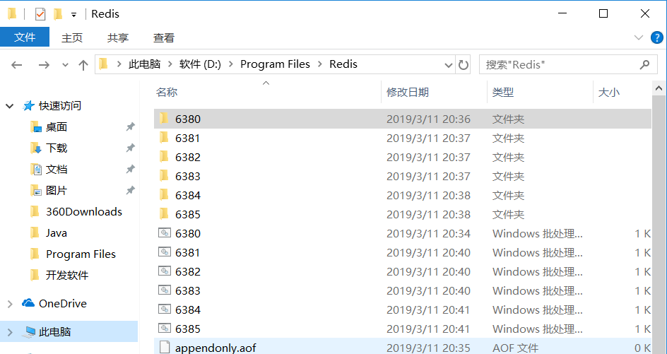

2）拷贝redis.windows.conf配置文件
```
将安装的Redis文件夹中的redis.windows.conf文件分别拷贝到新建的6个文件夹中，并改名为redis.conf。
```
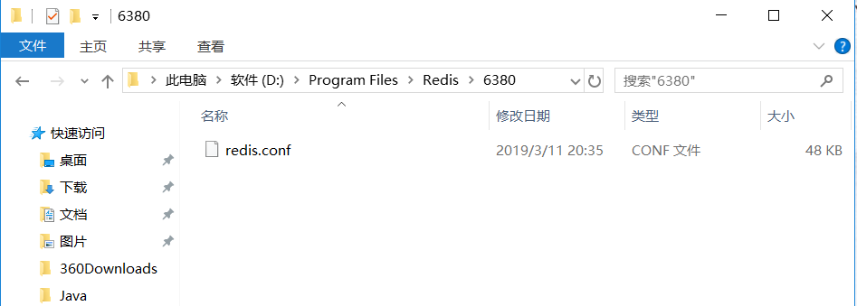

3）更改配置
```
将6个文件夹下的redis.conf文件中的以下属性进行修改：
```
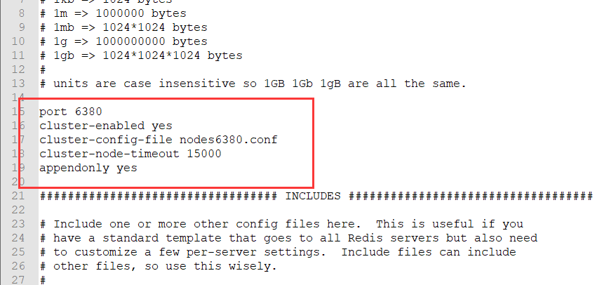

4）启动6个redis服务
```
分别创建与6个端口对应的bat文件，用来启动服务。
```
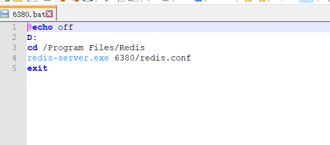

### 3.安装Redis的Ruby驱动redis-xx.gem
下载地址：https://rubygems.org/pages/download

本文提供下载文件[rubygems-3.0.3.zip](../tools/windows/rubygems-3.0.3.zip)

1）解压压缩包
```
下载后解压，在命令提示符中将当前目录切换到解压目录，然后在命令行执行ruby setup.rb。
```
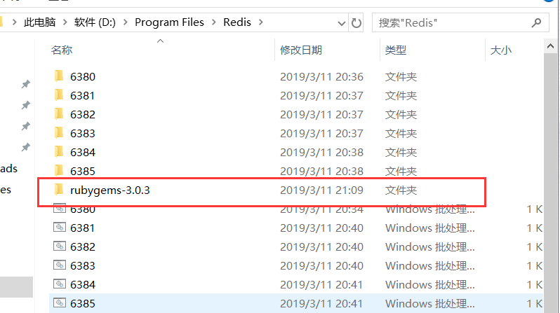

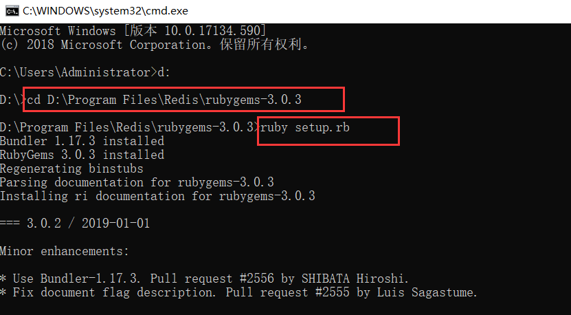

2）GEM安装Redis
```
切换到Redis安装目录，在命令行中执行gem install redis
```
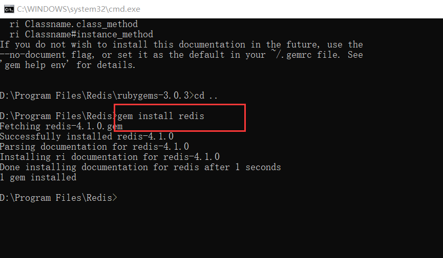
### 4.安装集群脚本redis-trib
1）下载redis-trib

下载地址https://raw.githubusercontent.com/antirez/redis/unstable/src/redis-trib.rb
```
打开该链接如果没有下载，而是打开一个页面，那么将该页面保存为redis-trib.rb，建议保存到一个Redis的目录下，例如放到Redis目录下。
```
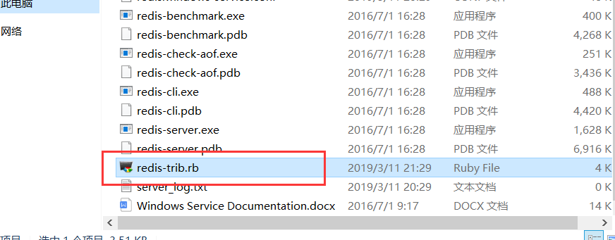

2）安装脚本
```
集群的命令为:
ruby redis-trib.rb create --replicas 1 127.0.0.1:6380 127.0.0.1:6381 127.0.0.1:6382 127.0.0.1:6383 127.0.0.1:6384 127.0.0.1:6385

--replicas 1 表示每个主数据库拥有从数据库个数为1。master节点不能少于3个，所以我们用了6个redis

注意：如果出现创建集群不成功，出现以下错误：
```
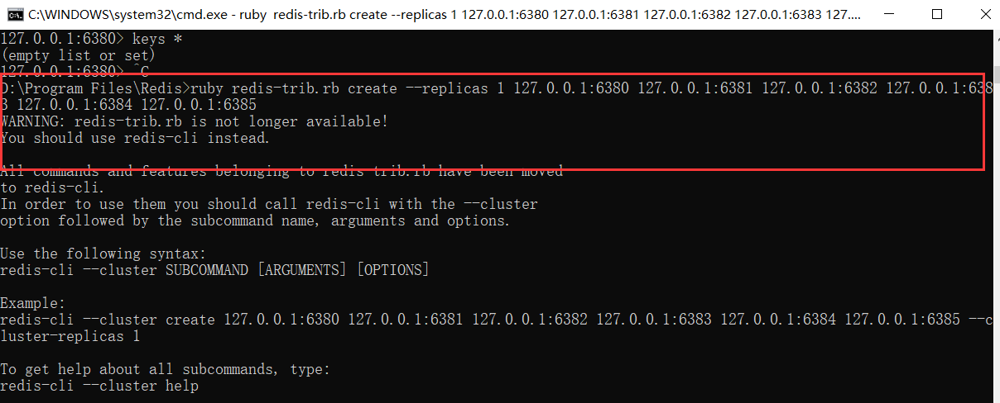
```
原因是redis-trib.rb的链接指向官网最新的版本。从对应版本（redis3.2.0即可）的源码压缩包中src文件夹下找到对应的redis-trib.rb文件使用，即可解决问题。
```
下载redis源码版压缩包：http://download.redis.io/releases/
```
下载完成redis-trib文件后，再次执行:
ruby redis-trib.rb create --replicas 1 127.0.0.1:6380 127.0.0.1:6381 127.0.0.1:6382 127.0.0.1:6383 127.0.0.1:6384 127.0.0.1:6385
```
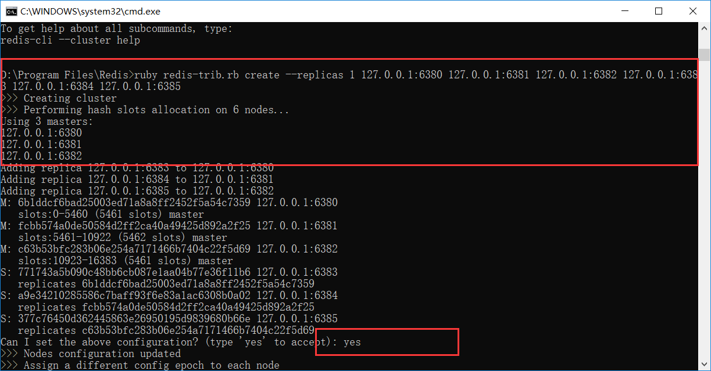
```
在出现 Can I set the above configuration? (type 'yes' to accept):   请确定并输入 yes 。成功后的结果如下：
```
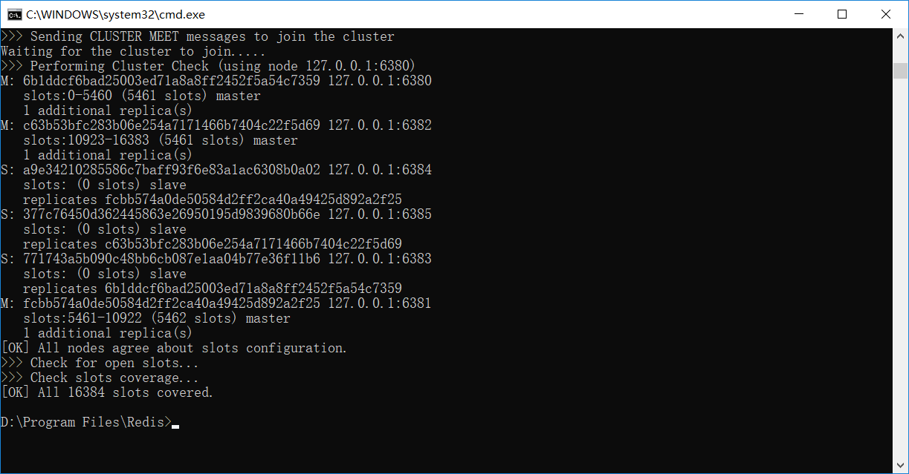

### 5.连接集群进行测试
1）连接集群的指令：
```
方式一：
redis-cli.exe -h 127.0.0.1 -c -p 6380
方式二：
redis-cli.exe -c -p 6380
```
2）输入dbsize查询 记录总数。

3）输入cluster info可以从客户端的查看集群的信息。
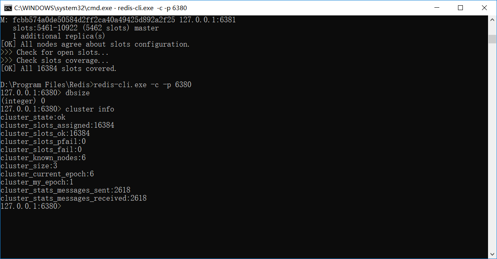

4）执行set 命令我们能看到集群起效，把值存到 6381 节点上了

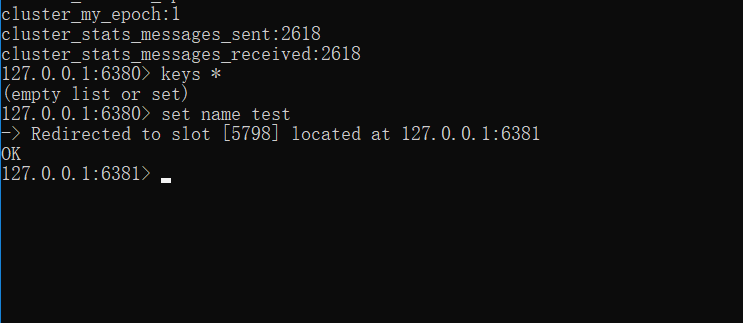
### 6.至此，Redis Cluster在Windows上的配置就完成了

