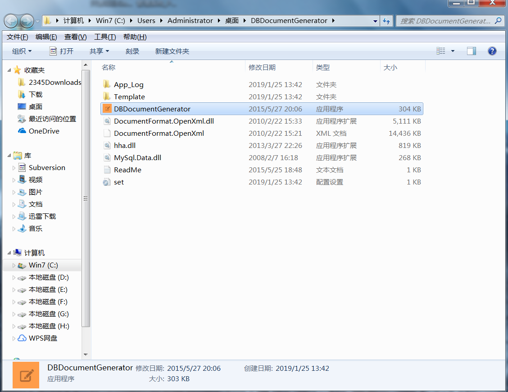
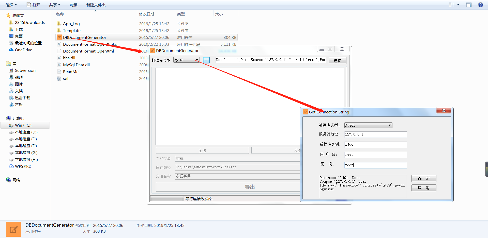
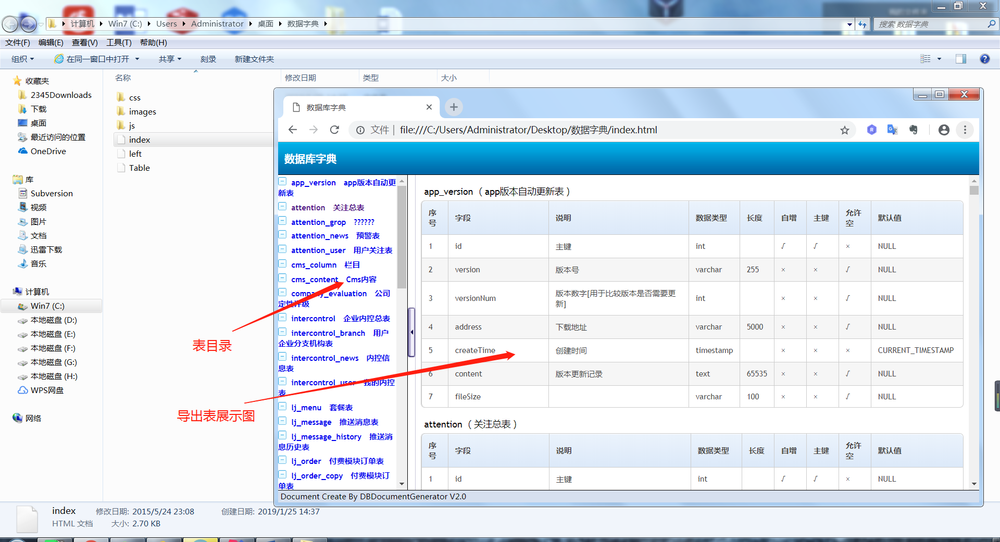

# DBDocumentGenerator的使用

下载文件 [DBDocumentGenerator.zip](../tools/windows/DBDocumentGenerator.zip)
### 1、将压缩包解压到自己的文件夹，就可以使用
 
 
### 2.使用步骤

```
1）按图片所示打开软件，设置好所要生成的数据库种类，并填上对应信息
``` 
 
 
``` 
2）连接数据库成功后，选择要导出的表，选择好导出格式和地址，就可以导出
``` 
 
 
### 3.生成html格式效果

 
