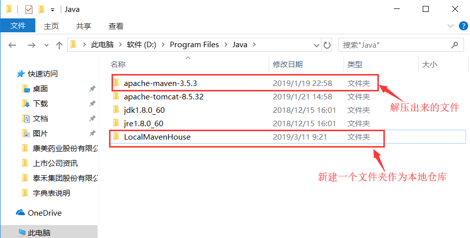
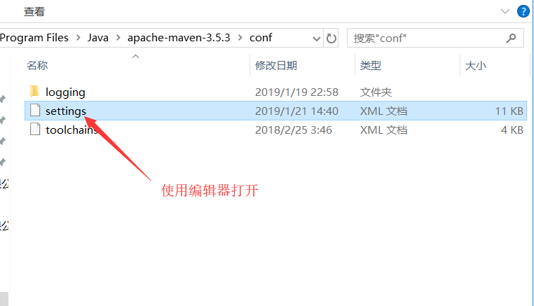
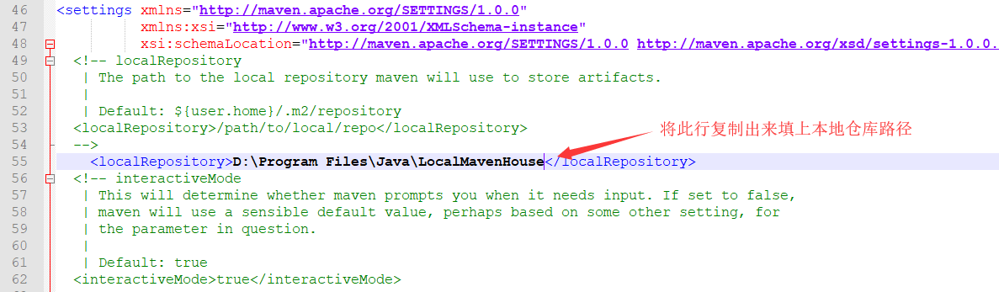
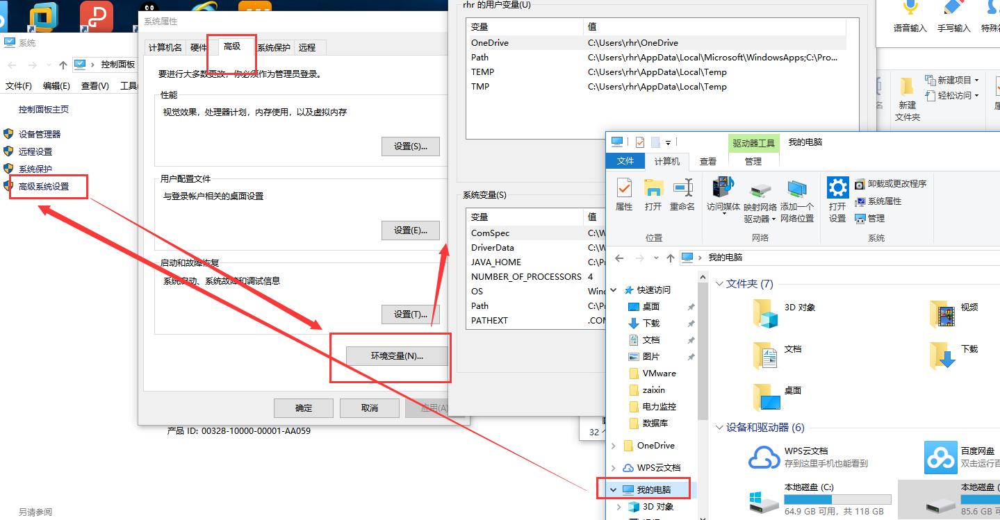
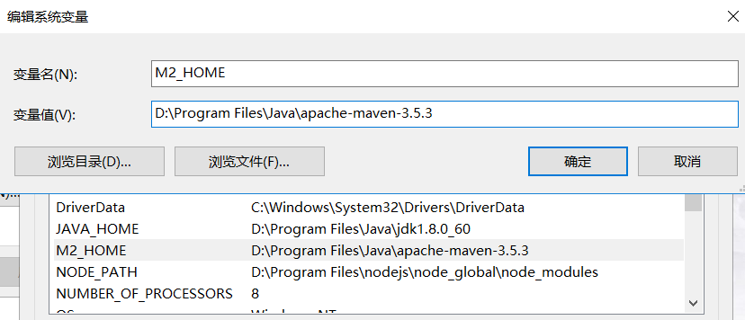
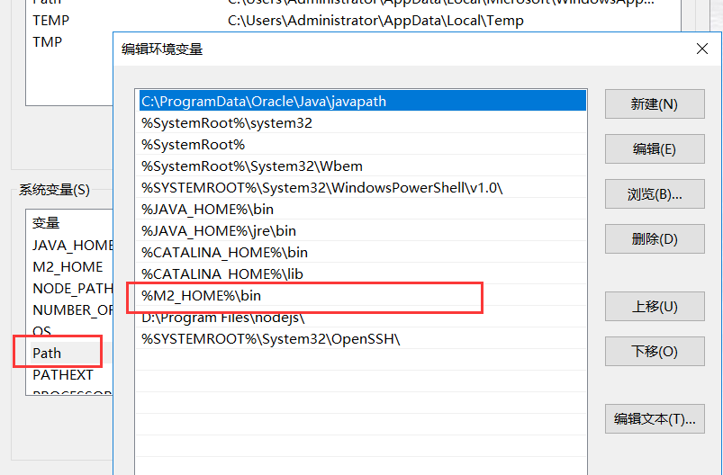
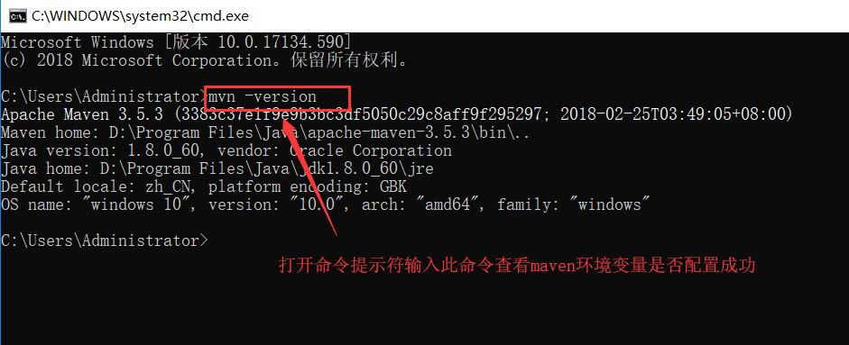
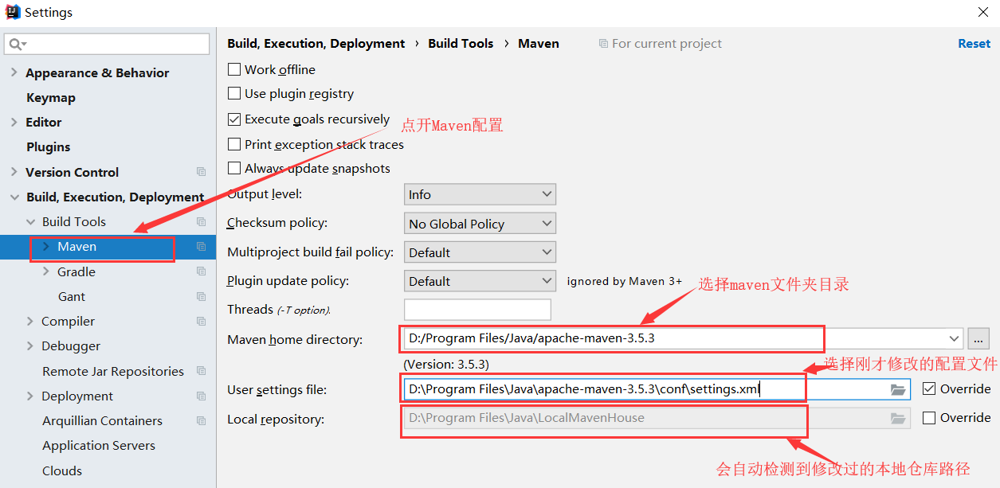

# Maven的安装与配置

下载文件 [apache-maven-3.5.3.gz](../tools/windows/apache-maven-3.5.3.gz)
### 1、将压缩包解压并创建一个本地仓库文件夹
 
 
### 2.配置本地仓库路径
 
  
 
 
### 3.配置maven环境变量

1）调出环境变量配置

我的电脑--右键--属性--高级系统设置--高级--环境变量

 

2）开始配置环境变量

a、新增系统变量：
```
M2_HOME   
D:\Program Files\Java\apache-maven-3.5.3(自己maven的安装目录)
```
 
 
b、配置系统变量 
 ```
PATH：新增 %M2_HOME%\bin
 ```
 
 
 c、测试环境变量是否配置成功
 
 
### 4、在IntelliJ IDEA中配置maven
打开File-Settings
 

### 5.至此，Maven已安装完成