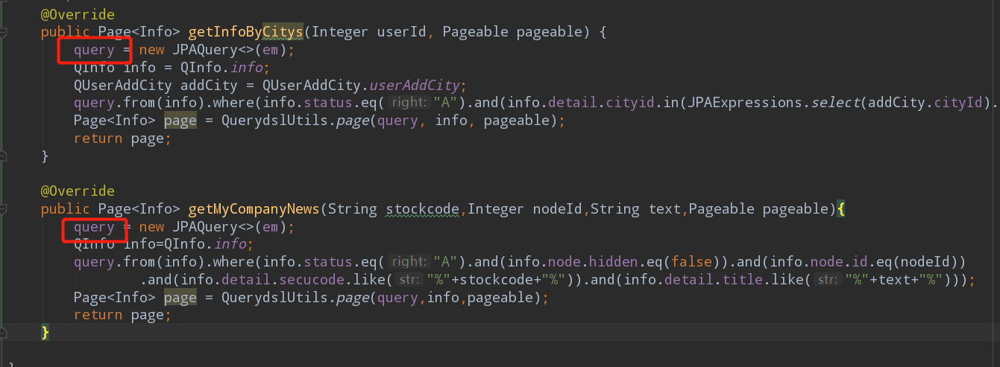
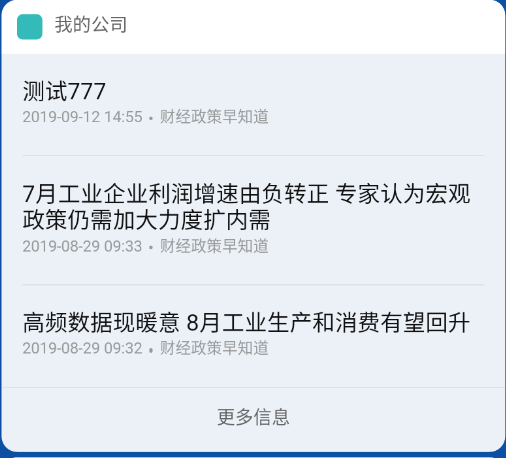
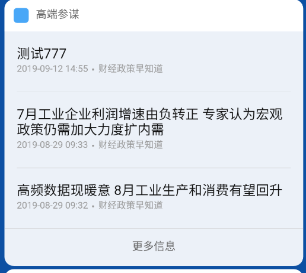
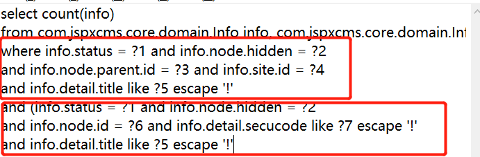
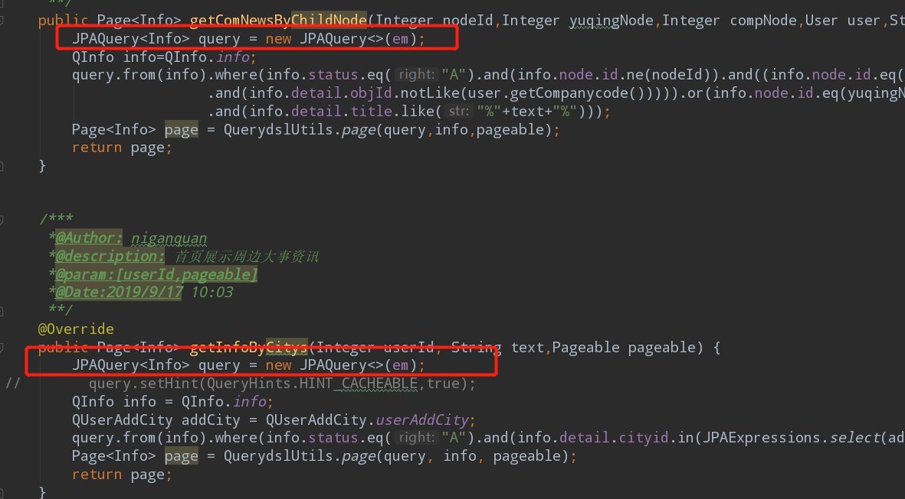

# 经验总结
## 1.文件检查
```
所有文件在整理好之后再检查一遍
```
## 2.服务器时间检查
```
有关具体时间的定时任务系统部署liunx后注意服务器时间是否正常，若时间不准会导致定时任务不执行
```
## 3.QueryDsl查询数据错乱
** 在使用JPAQuery查询时，不要将JPAQuery对象声明为成员变量使用，当同时有多个请求调用这个对象时，会引发线程安全问题。\
错误示范如下：\
\
这个两个方法中的query都引用了同一个成员变量，此时如果这两个方法同时被调用，则有可能出现如下情况：
\
\
有一个接口返回的数据使用了另一个方法中的query结果导致。\
或者是如下情况：\
\
导致这种情况是因为在拼接query的时候，多个query被同时引用，导致最后拼接出的HQL为：\
\
所以查询出来的结果为空。\
正确操作如下图：\
\
不在类中声明成员变量，而是在方法中单独创建JPAQuery对象，保证创建出来的对象都是独立的，这在被同时调用时，才不会出现混乱的情况


